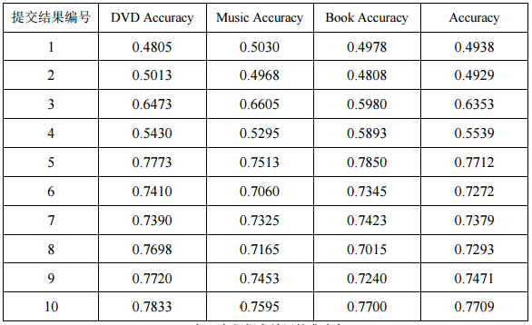

# CoTrain Report
## 背景介绍
NLP&CC 2013 - 03 跨语言情感分类评测

给定已标注倾向性的英文评论数据和英文情感词典，要求只利用给出的英文情感资源进行中文评论的情感倾向分类。该任务注重考察多语言环境下情感资源的迁移能力，有助于解决不同语言中情感资源分布的不均衡问题。

## 工具和数据集
实验数据：

* http://tcci.ccf.org.cn/conference/2013/dldoc/evsam03.zip
* http://tcci.ccf.org.cn/conference/2013/dldoc/evans03.zip

环境：

* Ubuntu 16.04
* Python 2.7

工具：

* jieba 中文分词
* googletrans (在中国因为网络问题需要修改googletrans的源代码，拟向开发者提交修改)
* sklearn (tf-idf)
* scipy, numpy, xml等

评价方法：

* Accurancy

## 算法
协同训练 Cotrain(Wan 2009)

条件：

* Fen：英文训练集，Fcn：中文训练集
* L ：已标注的训练集
* U：未标注的训练集

循环I次：

* 基于英文特征Fen从L中学习到英文分类器Cen；
* 利用英文分类器Cen对U中的评论进行标注；
* 从标注结果中选择最可信的p个正例和n个负例组成集合Een；
* 基于中文特征Fcn从L中学习到中文分类器Ccn；
* 利用中文分类器Ccn对U中的评论进行标注；
* 从标注结果中选择最可信的p个正例和n个负例组成集合Ecn；
* 将Een∪Ecn(不包含被两个分类器标注冲突的例子)加入到已标注集合L;
* 从未标注集U中删除Een∪Ecn;

翻译方法：

* Google Translate

机器学习方法：

* Logistic Regression

## 实验结果
* p=n=5， I=40

|类别|Accurancy|正确数量|测试集大小|
|----------|----------|----------|----------|
|book|0.758|3032|4000|
|dvd|0.774|3096|4000|
|music|0.74325|2943|4000|
|合计|0.7559|9071|12000|

NLP&CC 2013 评测结果：

## 实验结果分析
1. 通过评测结果比较，CoTrain在NLP&CC 2013所有方法中属于较好水平，说明CoTrain在跨语言情感分类中确实很有效。

2. 机器学习的算法选择中，尝试了SVM和LR，LR结果明显好于SVM，因此最终使用了LR。

3. 由于时间关系，模型仍然有很多可以改进的地方没有实现，例如特征只提取了分词后的结果的tf-idf，没有进行更进一步的分析，可以考虑加入Word Simlarity、上下文信息等。

